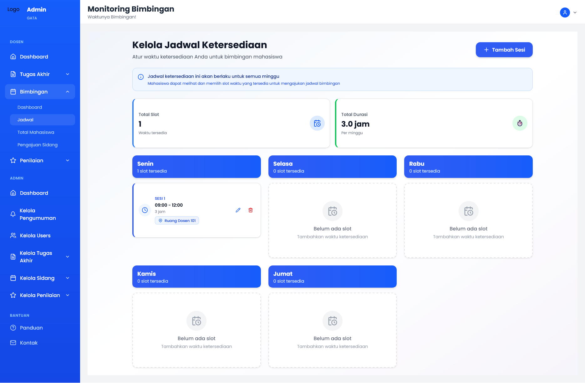
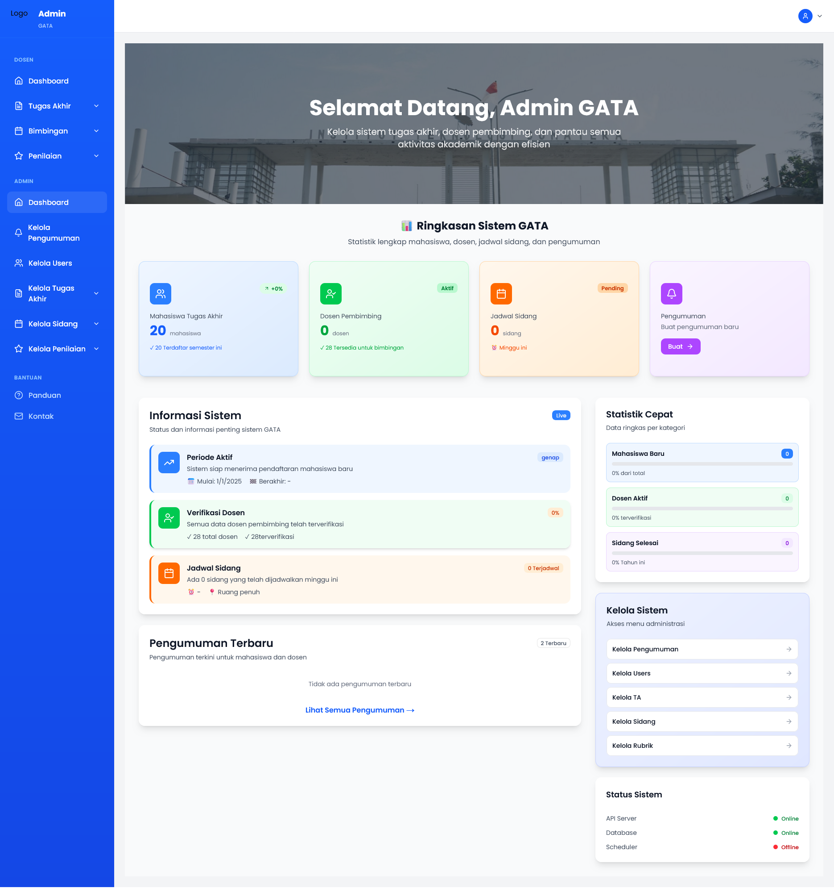
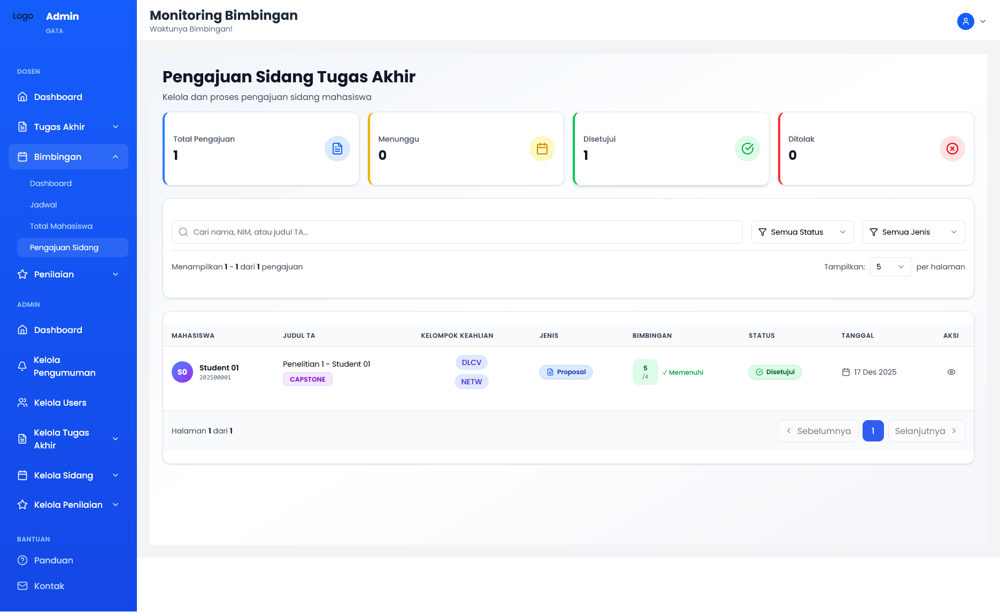
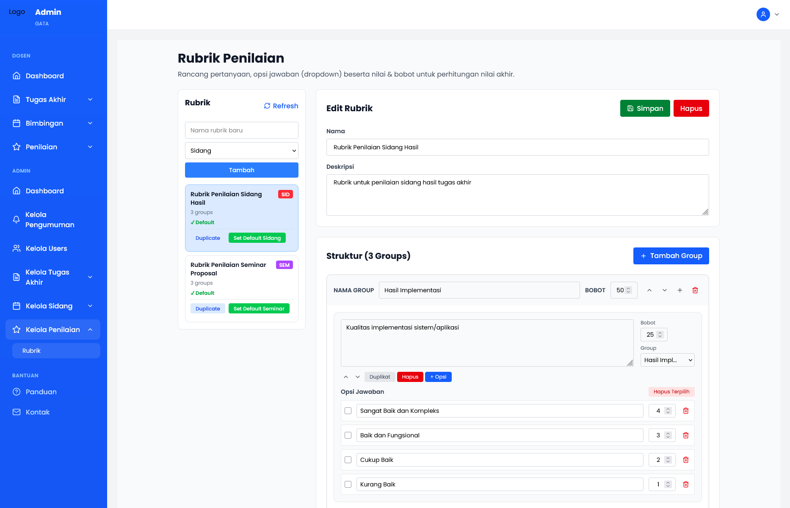
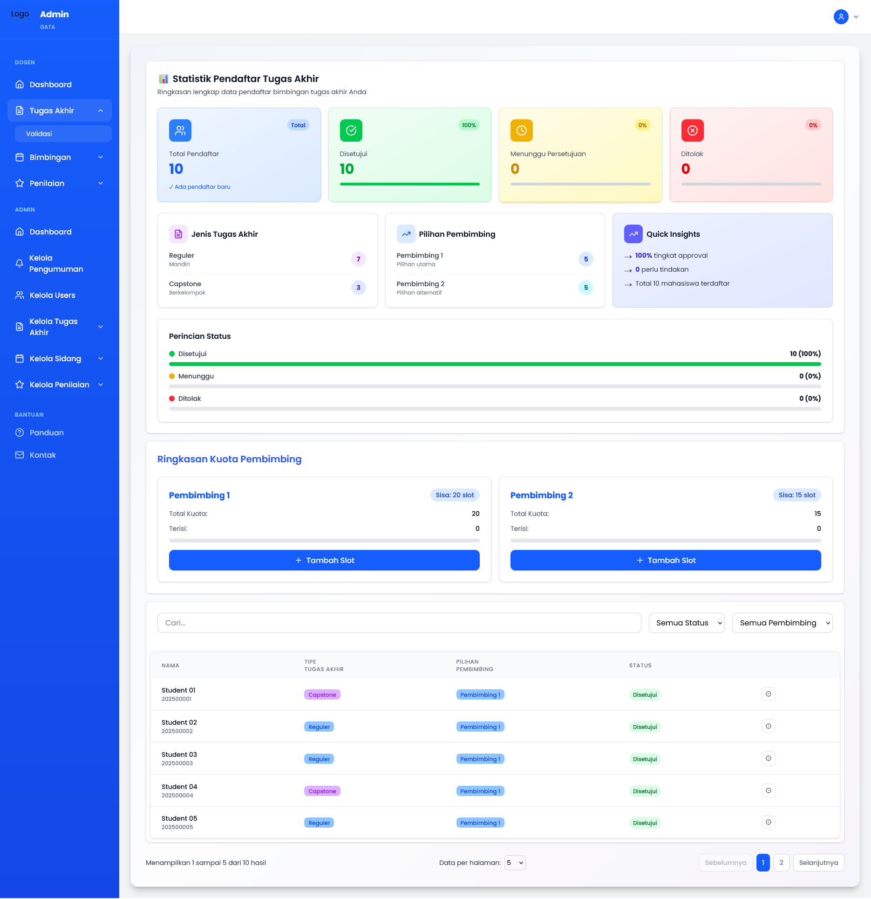

# 🎓 GATA - Gerbang Administrasi Tugas Akhir Teknik Informatika

**GATA** adalah platform web komprehensif untuk mengelola seluruh proses tugas akhir (skripsi) mahasiswa Teknik Informatika, mulai dari bimbingan, pengajuan sidang, hingga penilaian hasil akhir.

---

## 📸 Preview Aplikasi

### Dashboard Admin & Monitoring




### Manajemen Sidang & Penilaian




### Validasi Data



---

## ✨ Fitur Utama

### 🏢 Admin Dashboard

- **Monitoring Bimbingan** - Mengelola jadwal ketersediaan dosen untuk sesi bimbingan mahasiswa
- **Pengajuan Sidang** - Mengelola pengajuan sidang (proposal dan hasil) dari mahasiswa dengan status tracking
- **Rubrik Penilaian** - Membuat, mengedit, dan mengelola rubrik penilaian untuk sidang dengan multiple criteria
- **Manajemen User** - Kelola admin, dosen, dan mahasiswa sistem dengan role-based access
- **Kelola Pengumuman** - Membuat dan menyebarkan pengumuman penting kepada seluruh pengguna
- **Statistik & Laporan** - Dashboard analytics menampilkan statistik tugas akhir dan progress monitoring

### 👨‍🏫 Portal Dosen

- **Dashboard Dosen** - Overview mahasiswa bimbingan, jadwal sidang mendatang, dan statistik
- **Kelola Bimbingan** - Manajemen jadwal ketersediaan dan tracking progress bimbingan
- **Penilaian Sidang** - Memberikan penilaian terhadap sidang proposal dan hasil akhir
- **Input Revisi** - Mencatat hasil revisi dan memberikan feedback kepada mahasiswa
- **Riwayat Sidang** - Melihat riwayat lengkap dari semua sidang yang telah ditangani

### 👨‍🎓 Portal Mahasiswa

- **Dashboard Mahasiswa** - Overview status bimbingan, pengajuan sidang, dan penilaian
- **Pengajuan Sidang** - Submit permintaan sidang proposal dan hasil dengan kelengkapan dokumen
- **Status Bimbingan** - Tracking progress bimbingan dan jadwal konsultasi dengan dosen
- **Hasil Penilaian** - Melihat hasil penilaian sidang dan feedback dari penguji
- **Akses Pengumuman** - Mendapatkan informasi terbaru dan pengumuman penting dari sistem

### 🔐 Sistem Keamanan

- **Autentikasi JWT** - Sistem login/logout dengan token-based authentication
- **Role-Based Access Control** - Pembatasan akses berdasarkan role pengguna (Admin, Dosen, Mahasiswa)
- **Manage Lupa Password** - Recovery akun dengan email verification dan reset password flow
- **Session Management** - Automatic session handling dan token refresh

---

## 🛠️ Tech Stack

| Kategori           | Teknologi                 |
| ------------------ | ------------------------- |
| **Framework**      | Next.js 15.3.8, React 19  |
| **Styling**        | Tailwind CSS 4, Radix UI  |
| **Forms**          | React Hook Form           |
| **Tables**         | TanStack React Table      |
| **Language**       | TypeScript                |
| **Icons**          | Lucide React, React Icons |
| **Authentication** | JWT (Jose), JsonWebToken  |

---

## 🚀 Quick Start

### Prerequisites

- Node.js 18+
- npm atau yarn

### Installation

```bash
# Install dependencies
npm install

# Setup environment variables
cp .env.example .env.local

# Run development server
npm run dev
```

Server akan berjalan di [http://localhost:3000](http://localhost:3000)

### Build & Deploy

```bash
# Build production
npm run build

# Start production server
npm start
```

---

## 📁 Project Structure

```
gata-frontend/
├── app/                      # Next.js app directory
│   ├── auth/                # Authentication pages (login, register, reset)
│   ├── admin/               # Admin dashboard & pages
│   ├── dosen/               # Lecturer portal pages
│   ├── mahasiswa/           # Student portal pages
│   └── api/                 # API routes
├── components/              # Reusable React components
│   ├── badges/             # Status badges
│   ├── buttons/            # Button components
│   ├── cards/              # Card layouts
│   ├── dialogs/            # Modal dialogs
│   ├── forms/              # Form components
│   └── ui/                 # UI utility components
├── containers/             # Container/page components
├── hooks/                  # Custom React hooks
├── lib/                    # Utility functions
├── types/                  # TypeScript type definitions
├── utils/                  # Helper functions & API clients
└── public/                 # Static assets
```

---

## 📋 Type Definitions

Project menggunakan TypeScript dengan comprehensive type definitions untuk:

- **Authentication** - User, Login, Register, Token management
- **Users** - Admin, Lecturer (Dosen), Student (Mahasiswa) profiles
- **Bimbingan** - Guidance sessions, tracking, availability
- **Sidang** - Defense (proposal & hasil), scheduling, participants
- **Penilaian** - Grading, rubrics, scoring
- **Dashboard** - Statistics, analytics, data visualization

---

## 🎨 UI Components

Aplikasi menggunakan component library modern:

- **Radix UI** - Unstyled, accessible components
- **Tailwind CSS** - Utility-first CSS framework
- **Custom Badges** - Status indicators untuk berbagai state
- **React Icons** - Comprehensive icon set
- **Form Controls** - Advanced form handling dengan React Hook Form

---

## 🔄 Work in Progress

Project ini masih dalam tahap pengembangan aktif. Fitur-fitur baru dan improvements terus ditambahkan.

---

## 📞 Support & Contact

Untuk pertanyaan atau masalah teknis, silahkan hubungi tim development.

---

**Made with ❤️ for Teknik Informatika Students**
